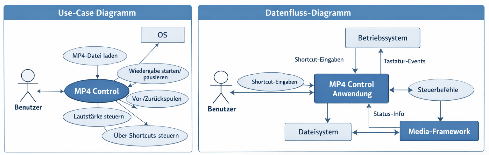

# 1. Ist-Kontext

## Use-Case Diagramm & DFD

---

## 1.1 Use-Case Diagramm (Beschreibung)

### Akteure
- Benutzer
- Betriebssystem
- Mediaplayer / Media-Framework

### Use-Cases
- MP4-Datei laden
- Wiedergabe starten/pausieren
- Wiedergabe stoppen
- Vor-/Zurückspulen
- Lautstärke steuern
- Globalen Shortcut registrieren
- Wiedergabe über Shortcuts steuern (im Hintergrund)

---

## 1.2 DFD (Datenflussbeschreibung)

### Prozess
- MP4-Control-Anwendung

### Terminatoren
- Benutzer
- Betriebssystem
- Dateisystem
- Media-Framework

### Datenflüsse
- Benutzer → System:
  - Shortcut-Eingaben
  - MP4-Datei

- System → Media-Framework:
  - Steuerbefehle (Play, Pause, Seek)

- Media-Framework → System:
  - Status (Playing, Paused, Position)

- Betriebssystem → System:
  - Globale Tastaturevents

- System → Betriebssystem:
  - Hotkeys registrieren

- System → UI:
  - Statusanzeige

- System ↔ Dateisystem:
  - Zugriff auf MP4-Dateien

---

## 1.3 API

### Betriebssystem API
- RegisterHotKey()
- EventListener für globale Tastatureingaben

### Media API
- Play()
- Pause()
- Stop()
- Seek(time)
- GetPlaybackState()

### Dateisystem API
- OpenFile(path)

---

## 1.4 UI + Rollen

### Rolle
- Benutzer

### UI-Elemente
- Dateiauswahl (MP4 laden)
- Play/Pause Button
- Fortschrittsanzeige (Timeline)
- Lautstärkeregler
- Shortcut-Konfiguration

### Besonderheiten
- Steuerung auch ohne Fokus
- Globale Shortcuts als Hauptinteraktion

---

## 1.5 Geschäftsprozesse

1. Anwendung starten
2. MP4-Datei laden
3. Media-Framework initialisieren
4. Wiedergabe starten
5. Steuerung über Shortcuts
6. Verarbeitung im Hintergrund
7. Statusanzeige aktualisieren

---

## 1.6 Gesetzliche Vorschriften

### Urheberrecht
- Nutzung nur bei vorhandenen Rechten

### Datenschutz (DSGVO)
- Keine unnötige Datenspeicherung
- Zweckbindung bei Logs

### Sicherheit
- Kein Keylogging
- Nur notwendige globale Eingaben erfassen

### Plattformrichtlinien
- Einschränkungen bei globalen Hooks je nach OS

# 2. Ist-Zustand: 

### Wie macht der Kunde heute sein "Geschäft/Buisness"?
Der Kunde öffnet mp4 Datei manuell aus dem Explorer und steuert die Wiedergabe über die graphische Oberfläche des Windows Media-Player.

### Wo ist bei dem wie der Kunde heute arbeitet das Problem/Bedürfnis?
Das manuelle Öffnen und Betätigen der visuellen Oberfläche beansprucht viel Zeit.

# 3. Soll-Kontext
## 3.1 Use-Case Diagramm & DFD

---

## 3.2 UI + Rollen

### Rolle
- Benutzer

### UI-Elemente
- Dateiauswahl (MP4 laden)
- Play/Pause Button
- Fortschrittsanzeige (Timeline)
- Lautstärkeregler
- Shortcut-Konfiguration

### Besonderheiten
- Steuerung auch ohne Fokus via Tastaturshortcuts
- Globale Shortcuts als Hauptinteraktion

---
## 3.3 API

### Betriebssystem API
- Registrieren von Globalen Shortcuts
- Reagieren auf Eingabe von Tastatur

### Dateisystem API
- Dateipfade angeben und öffnen 

---
# 4. NFA - Software-Qualitätsmerkmale

## Änderbarkeit / Wartbarkeit
- **Änderbarkeit/Wartbarkeit:** Aufwand zur Durchführung vorgegebener Änderungen (Korrekturen, Verbesserungen, Anpassungen an Umgebung oder Anforderungen):
  - Relevant
  - Wieso?: Desto besser ist der code geschrieben, beschrieben und dokumentioert, desto schneller und effizienter können änderungen vorgenommen werden 
  - Wie Messbar?: messbar über Aufwand und komplexität
    
- **Analysierbarkeit:** Aufwand zur Diagnose von Fehlern oder zur Identifikation änderungsbedürftiger Teile:
  - Relevant
  - Wieso?: Schnelle Fehlererkennung, gute Lesbarkeit
  - Wie Messbar?: Codestandards
    
- **Konformität:** Grad der Einhaltung von Normen/Vereinbarungen zur Änderbarkeit:
  - Relevant
  - Wieso?: Einhaltung von Gesetzen/Vereinbarungen
  - Wie Messbar?: Rate in Prozent
    
- **Modifizierbarkeit:** Aufwand für Verbesserungen, Fehlerbehebung oder Anpassungen:
  - Relevant
  - Wieso?: Kleine Änderungen mit möglichst kleinem Aufwandt
  - Wie Messbar?: Zeitlicher Aufwandt
    
- **Stabilität:** Wahrscheinlichkeit unerwarteter Auswirkungen durch Änderungen:
  - Relevant
  - Wieso?: Soll nicht wegen jedem Fehler abstürzen
  - Wie Messbar?: Stürzt nicht ab (downtime)
    
- **Testbarkeit / Prüfbarkeit:** Aufwand zur Prüfung der geänderten Software:
  - Nicht relevant
  - Wieso?: Aufwandt rechtfertigt Nutzen nicht
 

---

## Benutzbarkeit
- **Benutzbarkeit:** Aufwand für die Nutzung und subjektive Bewertung durch Benutzer:
  - Relevant
  - Wieso?: Benutzbarkeit ist wichtig damit es einfach zu bedienen ist
  - Wie Messbar?: Kundenzufriedenheit
    
- **Attraktivität:** Anziehungskraft der Anwendung:
  - Nicht relevant
  - Wieso?: technische Funktionalität im Vordergrund
    
- **Bedienbarkeit:** Aufwand zur Bedienung der Software:
  - Relevant
  - Wieso?: einfache Bedienung
  - Wie Messbar?: Kundenzufriedenheit
    
- **Erlernbarkeit:** Aufwand zum Erlernen der Anwendung:
  - Relevant
  - Wieso?: Kundenzufriedenheit, leichte Handhabung
  - Wie Messbar?: Analyse bei Workshop
    
- **Konformität:** Grad der Einhaltung von Normen zur Benutzbarkeit:
  - Nicht relevant
  - Wieso?: keine sinnvollen Standards
    
- **Verständlichkeit:** Aufwand, Konzept und Nutzung zu verstehen:
  - Nicht relevant
  - Wieso? genaue Vorstellung des Kunden
    
 

---

## Effizienz
- **Effizienz:** Verhältnis von Leistungsniveau zu eingesetzten Ressourcen:
  - Relevant
  - Wieso?: effiziente Nutzung der Ressourcen
  - Wie Messbar?: Ressourcenüberwachung
    
- **Konformität:** Grad der Einhaltung von Effizienz-Normen:
  - Nicht relevant
  - Wieso?: keine sinnvollen Standards
    
- **Zeitverhalten:** Antwortzeiten, Verarbeitungszeiten, Durchsatz:
  - Relevant
  - Wieso?: schnelle Rückmeldung im Fehlerfall, möglichst geringe Reaktionszeiten
  - Wie Messbar?: Latenz
    
- **Verbrauchsverhalten:** Ressourcenverbrauch (CPU, Speicher, IO):
  - Nicht relevant
  - Wieso?: leichtgewichtige Applikation
    
 
---

## Funktionalität (siehe Issues)
- **Funktionalität:** Vorhandensein geforderter Funktionen
  - Relevant
    
- **Angemessenheit:** Lieferung korrekter/vereinbarter Ergebnisse
  - Relevant
    
- **Sicherheit:** Schutz vor unberechtigtem Zugriff
  - Relevant
    
- **Interoperabilität:** Zusammenarbeit mit anderen Systemen
  - Relevant
    
- **Konformität:** Einhaltung von Standards, Gesetzen, Vorschriften
  - Relevant
    
- **Ordnungsmäßigkeit:** Einhaltung anwendungsspezifischer Regeln
  - Relevant
    
- **Richtigkeit:** Eignung der Funktionen für spezifizierte Aufgaben
  - Relevant
  
  Es müssen alle Issues und Akzeptanzkriterien erfüllt werden

---

## Übertragbarkeit
- **Übertragbarkeit:** Aufwand zur Nutzung von Programm in anderen Umgebungen
  - Nicht relevant
    
- **Anpassbarkeit:** Anpassung an verschiedene Umgebungen
  - Nicht relevant
    
- **Austauschbarkeit:** Ersetzbarkeit durch/gegen andere Software
  - Nicht relevant  
    
- **Installierbarkeit:** Aufwand für Installation
  - Relevant -  - Muss bei PC ohne Internetverbindung, und Windows 10 konformen Spezifikationen innerhalb von 4 Minuten installiert werden können
    
- **Koexistenz:** Betrieb neben anderer Software
  - Relevant - System muss im Hintergrund laufen könn eund trotzdem verwendbar sein - Funktionen des Programmes funktionieren auch ohne Fokus
    
- **Konformität:** Einhaltung von Normen zur Übertragbarkeit
  - Nicht relevant
      
  Muss nur auf Windwos benutzbar sein, Kunde verwendet Windows Geräte
  Messbar: Programm ist verwendbar auf Windows
---

## Zuverlässigkeit
- **Zuverlässigkeit:** Kann die Software ein bestimmtes Leistungsniveau unter bestimmten Bedingungen über einen bestimmten Zeitraum aufrechterhalten? – Fähigkeit der Software, ihr Leistungsniveau unter festgelegten Bedingungen über einen festgelegten Zeitraum zu bewahren; auch Zeitraum bei Ernstfällen & Katastrophen
  - Relevant -  - Muss zu 90% des Arbeitstages (8 - 18 Uhr), bei Problemen od. Katastrophen sind Ausfälle bis 3 Wochen in Kauf zu nehmen
    
- **Fehlertoleranz:** Fähigkeit, ein spezifiziertes Leistungsniveau bei Software-Fehlern oder Nicht-Einhaltung ihrer spezifizierten Schnittstelle zu bewahren
   - Nicht relevant
     
- **Konformität:** Grad, in dem die Software Normen oder Vereinbarungen zur Zuverlässigkeit erfüllt
  - Relevant - - Angaben (siehe Zuverlässigkeit) müssen erfüllt werden
    
- **Reife:** Geringe Versagenshäufigkeit durch Fehlerzustände
  - Nicht relevant
    
- **Wiederherstellbarkeit:** Fähigkeit, bei einem Versagen das Leistungsniveau wiederherzustellen und die direkt betroffenen Daten wiederzugewinnen. Zu berücksichtigen sind die dafür benötigte Zeit und der benötigte Aufwand.
  - Relevant - - gespeicherte Daten sind auch bei einem Absturz des Programmes auf der Festplatte geschrieben

# 5. Ziele 
### Globale Shortcuts ermöglichen
     auch wenn ein anderes Fenster im Fokus ist sollen via Shortcuts die Dateien geöffnet werden können.
### Shortcuts personalisierbar machen
     Die MP4 Datei hinter den Shurtcuts kann geändert werden
### Shortcut-Vorlagen mit Vorlagenspezifischen Shortcuts
     Shortcuts Einstellungen können gespeichert und wieder aufgerufen werden.
### zwischen Shurtcut-Vorlagen wechseln
     Zwischen oben angeführten Einstellungen kann gewechselt werden.
### MP4 Dateien öffnen
     Innerhalb von 0.5 Sekunden wird die gewählte MP4 Datei geöffnet
### MP4 Dateien abspielen/pausieren (Toggle-Button)
     die offene MP4 Datei kann zu jedem Zeitpunkt pausiert oder abgespielt werden.
### Lautstärke erhöhen
     Lautstärke in 5% Schritten erhöhen
### Lautstärke reduzieren
     Lautstärke in 5% Schritten reduzieren
### Anzeigemodus verändern (Fullscreen - Fenster)
     Der MP4 Player kann in Fullscreen oder als Fenster angezeigt werden (Toggle-Button)
### Zurückspulen
     Das Video wird 5 Sekunden zurückgespult pro Klick
### Vorspulen
     Das Video wird 5 Sekunden vorgespult pro Klick
